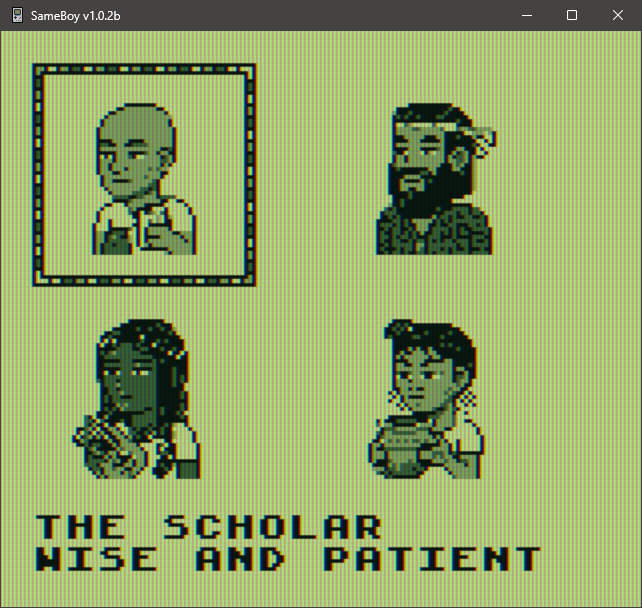
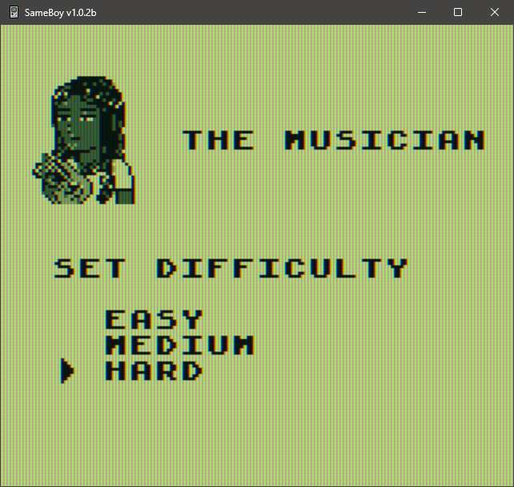
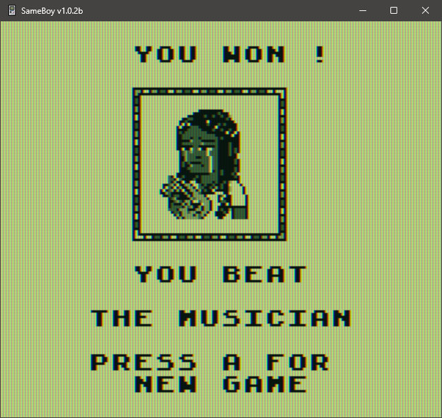
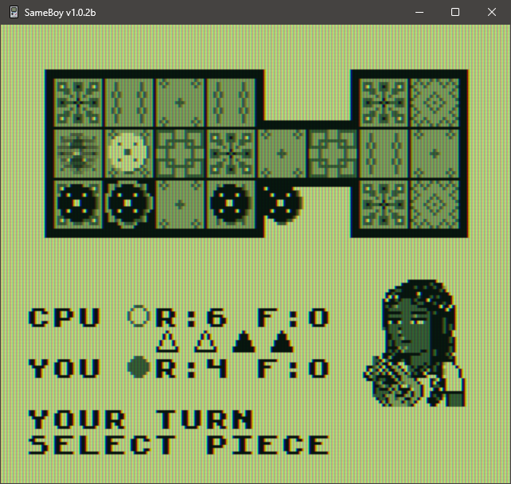

# Royal Game of Ur (Game Boy DMG)

A Game Boy implementation of the **Royal Game of Ur**, built in C with **GBDK-2020**.

The project includes:
- A full single-player mode against themed AI opponents
- Three difficulty levels
- Local two-player support over Game Boy link cable

## Features

- Classic Royal Game of Ur rules: 7 pieces per side, 4 binary dice, rosette bonus turns, captures, and exact bearing off
- Opponent profile selection with unique portraits and distinct play styles
- Difficulty settings:
  - **Easy**: AI follows its preferred move less often
  - **Medium**: AI follows preferred moves more consistently
  - **Hard**: AI always selects its preferred move
- Pause overlay showing turn count, elapsed time, and score progress
- Endgame win/lose screen with portrait reactions
- Link cable mode with synchronized board state and profile selection for both players

## Screenshots

### Profile Selection


### Difficulty Selection


### Victory Screen


## Project Structure

```text
.
├── src/
│   ├── screens/    # Screen state implementations (title, game, endgame, etc.)
│   ├── logic/      # Board state + AI logic
│   ├── link/       # Link cable connection + multiplayer sync
│   └── util/       # Shared systems (font, input, transitions, sound, portrait helpers)
├── include/        # Header files mirroring src/ organization
├── assets/         # Source art + generated tile/sprite/map data
├── docs/           # Design notes and supporting docs
└── Makefile        # Build targets for ROM compilation
```

## Requirements

- **GBDK-2020** toolchain installed
- `lcc` available (usually via GBDK)
- Optional emulator for testing the ROM (e.g., SameBoy, BGB, Emulicious)

By default, this repo's `Makefile` expects GBDK at:

```bash
/home/gbdev/gbdk
```

If your install path is different, either:
- update `GBDK_HOME` in `Makefile`, or
- export `GBDK_HOME` and adapt the Makefile accordingly.

## Build

To run the build on four cores run

```bash
make -j4
```

This produces:

```text
royal-ur.gb
```

### Clean build artifacts

```bash
make clean
```

### Run target

```bash
make run
```

`make run` currently prints a reminder to open the ROM in your emulator.

---

## How to Play

## 1) Game rules and board flow



### Goal
Be the first player to bear off (finish) all **7 pieces**.

### Turn steps
1. Press **A** when prompted to roll the 4 binary dice (total 0-4)
2. If roll is 0 (or no legal moves), turn passes
3. If moves are available:
   - **Left/Right** cycles selectable pieces
   - Preview shows target destination
   - **A** confirms move

### Core rules
- Pieces enter from reserve and advance along your path
- Landing on an opponent sends that piece back to reserve (**capture**)
- **Rosette squares** are special:
  - Landing on one grants an extra turn
  - Pieces on rosettes are safe from capture
- You cannot land on your own piece
- Bearing off requires exact movement to your finish position

### Pause
- Press **START** during single-player games to open/close pause overlay
- Pause displays turn count, elapsed time, and piece progress

---

## 2) Start a game mode
On the title screen:
- Press **Up/Down** to choose:
  - `START GAME` (single-player)
  - `LINK CABLE` (two-player)
- Press **A** to confirm

---

## 3) Single-player flow

### Select an opponent profile
- Navigate with **D-pad**
- Press **A** to select
- Press **B** to go back

Opponents:
- THE SCHOLAR
- THE MERCHANT
- THE MUSICIAN
- THE PRIESTESS

Each opponent uses a different play style.

### Select difficulty
- **Up/Down**: choose Easy / Medium / Hard
- **A**: confirm
- **B**: return to opponent selection

### Choose side (coin flip screen)
- **Left/Right**: choose **LIGHT** or **DARK**
- **A**: lock in and run coin flip
- Coin result decides who goes first

---

## 4) Link cable flow (two players)

- Connect two Game Boys (or compatible emulator instances) with link cable support
- Choose `LINK CABLE` from title
- Follow connection and side assignment prompts
- Each player selects a profile
- Game begins once synchronization is complete

If link communication times out or disconnects, the game returns to title.

---

## 5) Win condition
A player wins immediately after bearing off all 7 pieces.

On the result screen:
- Press **A** to return and start a new match flow.

## Notes

- This is a DMG-targeted project; visuals are optimized for classic 4-shade Game Boy rendering.
- Asset files under `assets/generated/` are build outputs from conversion tools and generally should not be edited manually.
